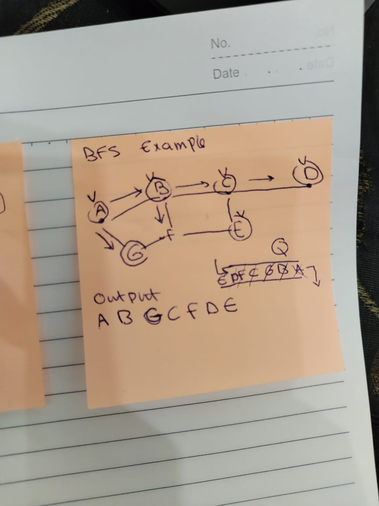
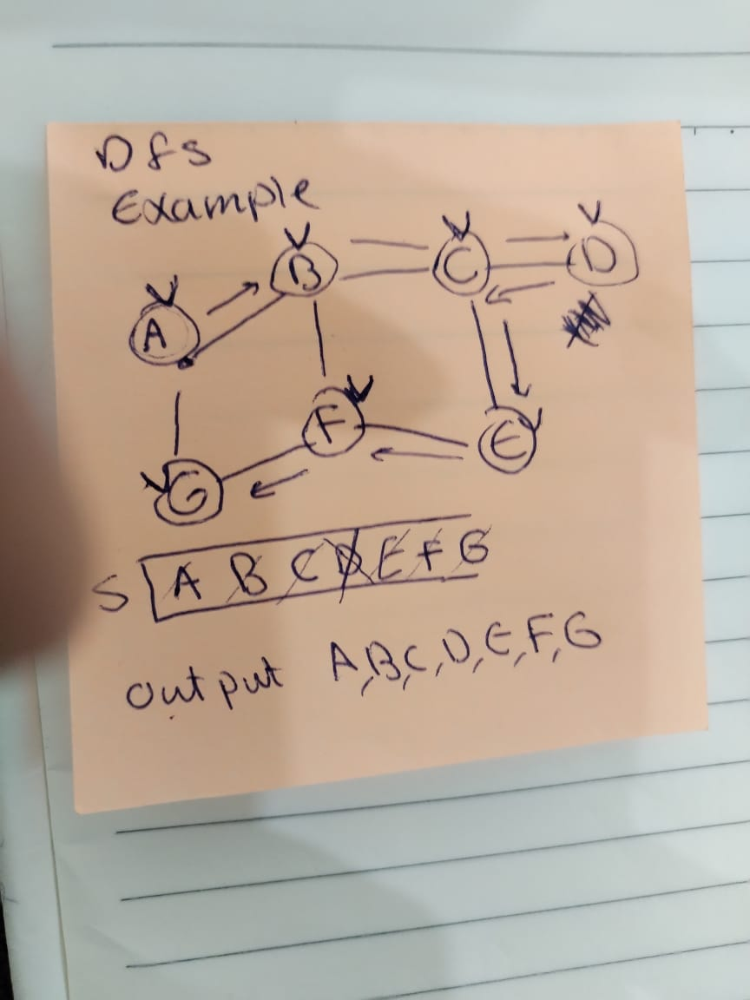

# Instant-AI-6and5-Tasks
the answer to the tasks provided in session 5 and session 6

# Instant AI Session 5 and Session 6(Tasks)

# Session 5 Tasks
# 1) Examples of programming languages that do not have garbage collection and expects the developer tp allocate and deallocate explicitly:
* C
* C ++ 
* Assembly
* Fortran
## the programming languages that are having garbage collection
* Python, Java, C#

# 2) How can we improve garbage collection in OS

Garbage Collection is the automatic memory management. Memory management is the process of controlling a computer’s main memory. It ensures that blocks of memory are properly managed and allocated so the OS and other applications have the memory to carry out their operations. and it strives to optimize memory usage so the cpu can efficiently access the instructions and data it needs to execute the various processes.

Memory Management operates at 3 levels hardware, operating system and program application:

at Memory Management : => OS Level 
main purpose for it is to move processes between RAM and ROM
OS:
* allocate blocks of memory to individual processes depending on the Resources of the CPU 
* decides which process will get memory resources and the will be allocated 
* and handles situations where the computer runs out of physical memory space.

# Instant AI Session 6 (Tasks)

# 1) Differintiate between BFS and DFS

|  njnj   |                                                                                                    Breadth First Search                                                                                                    |                                                                                                                         Depth First Search                                                                                                                         |
|:-------:|:--------------------------------------------------------------------------------------------------------------------------------------------------------------------------------------------------------------------------:|:------------------------------------------------------------------------------------------------------------------------------------------------------------------------------------------------------------------------------------------------------------------:|
 |   km    |                                                                                                            BFS                                                                                                             |                                                                                                                                DFS                                                                                                                                 |
|   mk    |                                                                          uses a Stack data structure to keep track of the next location to visit                                                                           |                                                                                              uses a Queue data structure to keep track of the next location to visit                                                                                               |
|   kk    |                                                                         approach nodes on the same level first before moving on to the next level                                                                          |                                                               approach the root node and proceeds through the other nodes as far as possible until we reach the node with no unvisited nearby nodes                                                                |
|    m    |                                                                                         finds the shortest path to the destination                                                                                         |                                                                                                          goes to the bottom of a subtree then backtracks                                                                                                           |
|    m    |                                 <ul><li>finds the shortest path and a minimum spanning tree in unweighted graph </li><li>locates all the nearest nodes in a peer to peer network</li></ul>                                 |                                             <ul><li>finds the shortest path tree and minimum spanning tree in weighted graph</li><li>used to detect a cycle</li><li>used to search a path between 2 vertices</li></ul>                                             |
|    j    |                                                                                               requires more memory than DFS                                                                                                |                                                                                                                   requires less memory than BFS                                                                                                                    |
|    k    |       <ul><li>create a queue Q</li><li>mark v as visited and put v onto Q</li><li>while Q is non-empty:<ul><li>remove the head u of Q</li><li>mark and enqueue all unvisited neighbors of u</li></ul></li></ul> | <ul><li>create a stack S</li><li>mark v (node) as visited and push v onto S</li><li>while S is not Empty:<ul><li>peek the top u of S</li><li>if u has an unvisited neighbor w: <ul><li>mark w as visited and push it onto S</li></ul></li></ul></li><li>else pop S</li></ul> |
| Example |||

# Rana(2023)
